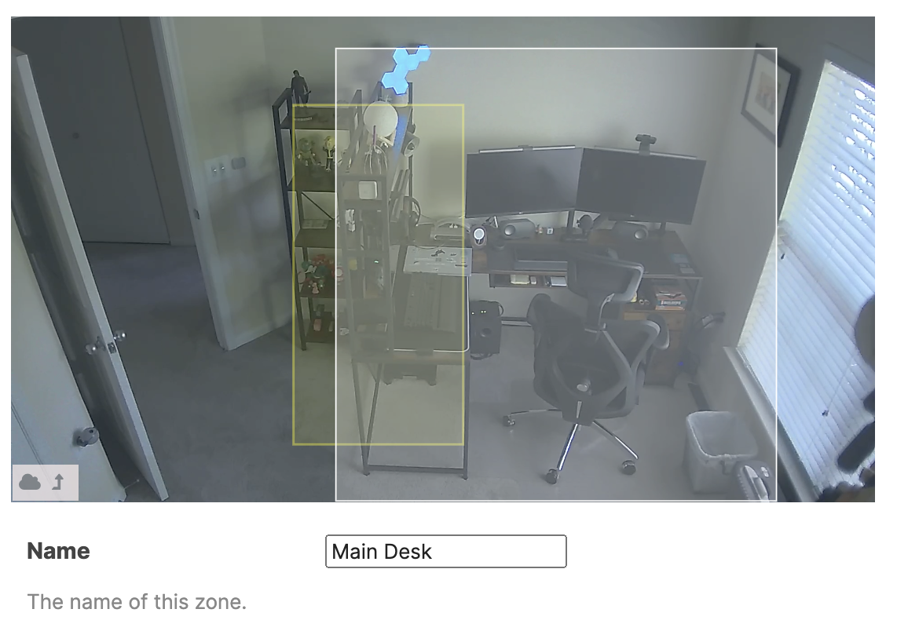
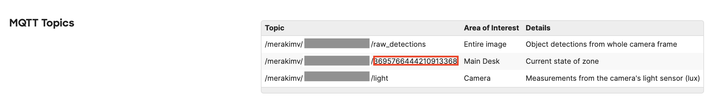
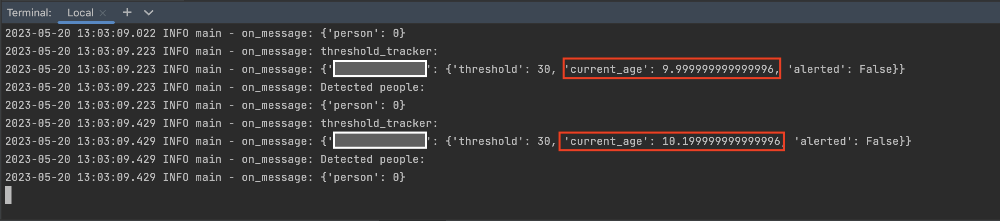
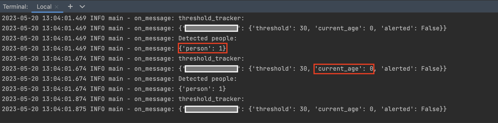
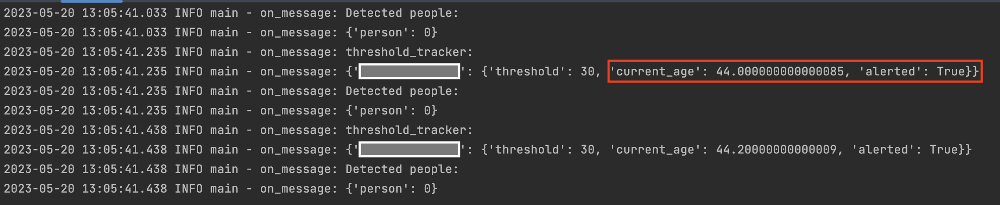
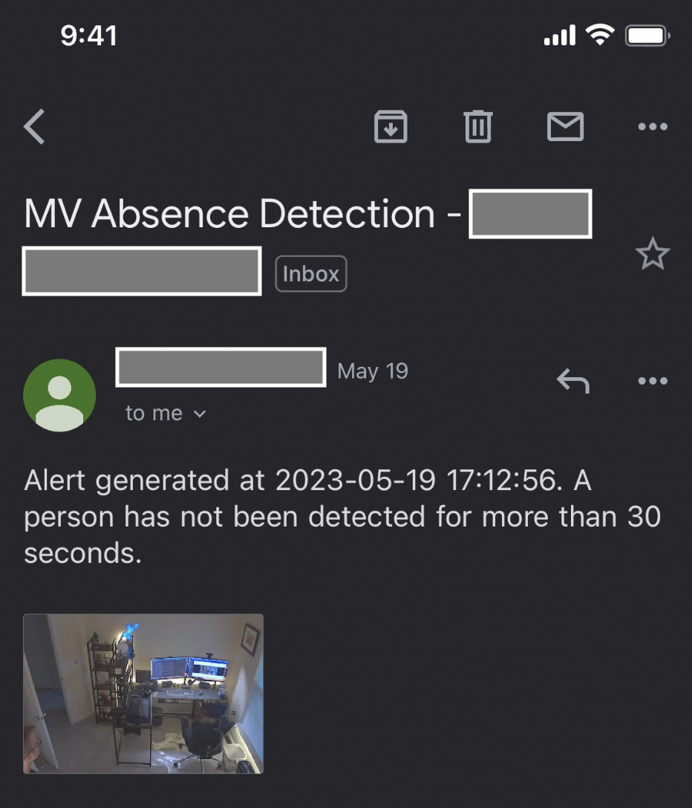
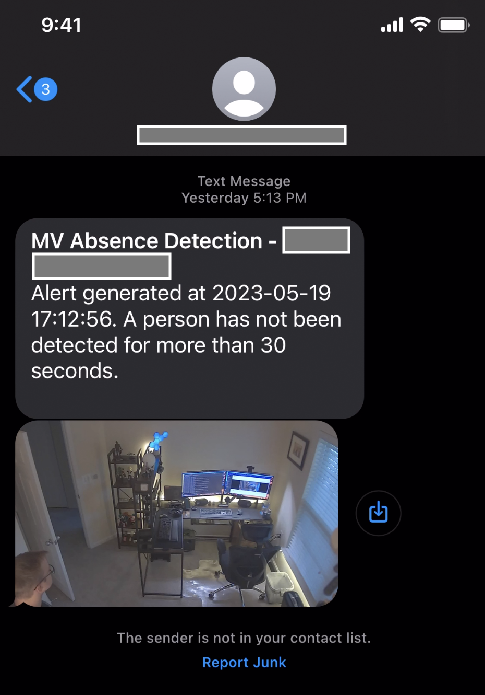

# Meraki MV People Absence Detection

This script subscribes to a Meraki MV telemetry stream through a MQTT broker, and it can detect whether a person has not been seen in a Camera Zone for more than a set threshold. When a person has been absent from the zone for longer than the threshold, an email and/or text alert is sent out.

## Contacts
* Trevor Maco

## Solution Components
* Meraki MV
* MQTT Broker
* Email (Gmail, Outlook), Text Messaging
* Python 3.11


## Prerequisites
#### Meraki API Keys
In order to use the Meraki API, you need to enable the API for your organization first. After enabling API access, you can generate an API key. Follow these instructions to enable API access and generate an API key:
1. Login to the Meraki dashboard
2. In the left-hand menu, navigate to `Organization > Settings > Dashboard API access`
3. Click on `Enable access to the Cisco Meraki Dashboard API`
4. Go to `My Profile > API access`
5. Under API access, click on `Generate API key`
6. Save the API key in a safe place. The API key will only be shown once for security purposes, so it is very important to take note of the key then. In case you lose the key, then you have to revoke the key and a generate a new key. Moreover, there is a limit of only two API keys per profile.

> For more information on how to generate an API key, please click [here](https://developer.cisco.com/meraki/api-v1/#!authorization/authorization). 

> Note: You can add your account as Full Organization Admin to your organizations by following the instructions [here](https://documentation.meraki.com/General_Administration/Managing_Dashboard_Access/Managing_Dashboard_Administrators_and_Permissions).

#### Meraki Camera MQTT API
**MQTT Broker**: MQTT-based protocols use a publish-subscribe connection between the client and server. In the case of MV Sense, the server is continuously pushing messages to the MV smart cameras so the device can respond instantly. This leads to a real-time feed of data coming from your camera. Follow these steps to configure a MQTT broker:
1. Start by navigating to `Cameras > Monitor > Cameras` and selecting the camera you would like to enable MV Sense on.
2. Once the camera is selected, go to `Settings > Sense`.
3. Click `Enabled`.
4. To enable MQTT on your camera and create a new MQTT broker configuration click `Add or edit MQTT Brokers`.

**Note**: For testing/trial you can find a public broker [here](https://github.com/mqtt/mqtt.org/wiki/public_brokers).

> For more information on using MQTT with Meraki cameras, please click [here](https://developer.cisco.com/meraki/mv-sense/#!mqtt/configuring-mqtt-in-the-dashboard).

> Note: If this is your organization's first time using MV Sense, you will have 10 free perpetual licenses available to use. If you have exceeded this 10 free license count, you must activate more licenses by navigating to `Organization > Configure > License Info` and claim more licenses.

#### Meraki Camera Zone
To create a Camera Zone:
1. Start by navigating to `Cameras > Monitor > Cameras` and selecting the camera you would like to create a zone on.
2. Once the camera is selected, go to `Settings > Zones`.
3. Create a new zone, provide a name and detection overlap.



## Installation/Configuration
1. Clone this repository with `git clone [repository name]`
2. Set up a Python virtual environment. Make sure Python 3 is installed in your environment, and if not, you may download Python [here](https://www.python.org/downloads/). Once Python 3 is installed in your environment, you can activate the virtual environment with the instructions found [here](https://docs.python.org/3/tutorial/venv.html).
3. Install the requirements with `pip3 install -r requirements.txt`

#### Meraki API, MQTT, Email, and Text Setup
1. Add Meraki API key to environment in `config.py`
```python
MERAKI_API_KEY = ""
```
2. Add MQTT information to environment in `config.py`. This is the same server and port configured on the Meraki Dashboard.
```python
MQTT_SERVER = ""
MQTT_PORT = None
```

3. Add email integration information to environment in `config.py`. Currently, GMail and Outlook are the only providers supported.
      * **Gmail**: Requires an 'app password' and some setup. Refer to this [guide](https://support.google.com/accounts/answer/185833?visit_id=638001725430109553-3882188526&p=InvalidSecondFactor&rd=1)
         * Once configured, enter email username and app password:
        ```python
        EMAIL_USERNAME = ""
        EMAIL_PASSWORD = ""
        SMTP_DOMAIN = "smtp.gmail.com"
        SMTP_PORT = 587
        ```
      * **Outlook**: Several configurations
        * If 2-factor is **NOT** configured, enter account username and password
        ```python
        EMAIL_USERNAME = ""
        EMAIL_PASSWORD = ""
        SMTP_DOMAIN = "smtp.office365.com"
        SMTP_PORT = 587
        ```
        * If 2-factor **is** configured: Refer to this [guide](https://support.microsoft.com/en-us/account-billing/manage-app-passwords-for-two-step-verification-d6dc8c6d-4bf7-4851-ad95-6d07799387e9#:~:text=Sign%20in%20to%20your%20work%20or%20school%20account%2C%20go%20to,page%2C%20and%20then%20select%20Done)
        * For **Corporate** Outlook accounts: Refer to this [guide](https://learn.microsoft.com/en-us/exchange/clients-and-mobile-in-exchange-online/authenticated-client-smtp-submission)

4. For text message support, this script leverages free texting using SMTP Email Servers. Please ensure the cell phone number provider is on the supported list found in `config.py`

#### Camera Inventory File

This script requires a camera inventory file called `cameras.json`. Provide a list of one or more cameras with the required fields:
```python
  {
        "CAMERA_SERIAL": "XXXX-XXXX-XXXX",
        "ZONE_ID": "XXXXXXXXXXXXXXX",
        "AGE_THRESHOLD": 30,
        "email": ["XXXX@email.com"],
        "text": ["123456789-AT&T"]
  }
```

* `Camera Serial`: Camera serial number (found on Meraki Dashboard)
* `Zone Id`: Zone ID (found on Meraki Dashboard under MQTT Topics)

* `Age Threshold`: Age (**in seconds**) before sending alert
* `Email`: A list of one or more emails (any provider) to send alerts too
* `Text`: A list of one or more phone numbers to send alerts too. The format **MUST** follow "[number]-[provider]" where provider is one of the supported provider names from `config.py`


## Usage
To run the program, use the command:
```
$ python3 main.py
```

When a person is not within the zone, the timer will increment:



When a person is detected within the zone, the counter resets to 0:



If the timer exceeds the threshold, an email and/or text will be sent:



Email:



Text:



# Screenshots


### LICENSE

Provided under Cisco Sample Code License, for details see [LICENSE](LICENSE.md)

### CODE_OF_CONDUCT

Our code of conduct is available [here](CODE_OF_CONDUCT.md)

### CONTRIBUTING

See our contributing guidelines [here](CONTRIBUTING.md)

#### DISCLAIMER:
<b>Please note:</b> This script is meant for demo purposes only. All tools/ scripts in this repo are released for use "AS IS" without any warranties of any kind, including, but not limited to their installation, use, or performance. Any use of these scripts and tools is at your own risk. There is no guarantee that they have been through thorough testing in a comparable environment and we are not responsible for any damage or data loss incurred with their use.
You are responsible for reviewing and testing any scripts you run thoroughly before use in any non-testing environment.